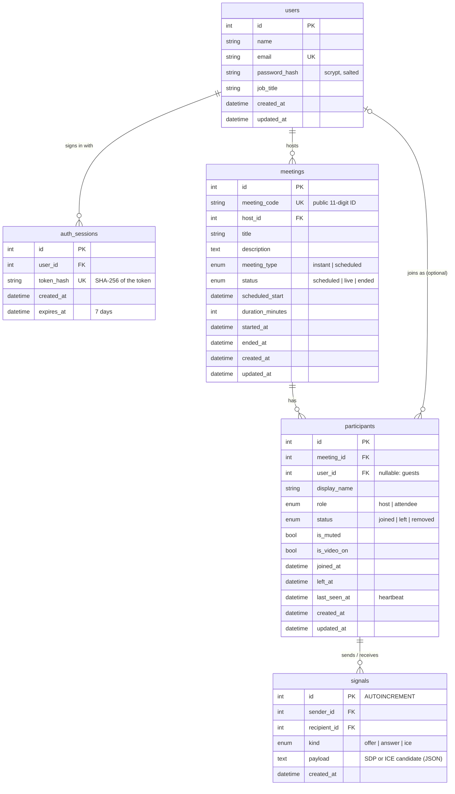

# Zoom Clone — Video Conferencing Platform

A Zoom-style meeting app for the Scaler SDE Fullstack assignment. You can sign up or sign in, start an instant meeting, join one by ID or invite link, schedule meetings for later, and manage a meeting room with live presence and host controls.

**Quick start for reviewers:** on the sign-in page, click **Continue with demo account**. It signs you in as Alex Morgan, whose account already has sample meetings. (Demo login: `alex.morgan@example.com` / `zoomdemo123`.)

**Stack:** Next.js 16 (App Router, TypeScript, Tailwind CSS v4) · FastAPI · SQLAlchemy 2 · SQLite

> **Live app: https://chandana-zoom-clone.vercel.app** (frontend on Vercel)
> **API: https://api-production-39bb6.up.railway.app** (FastAPI on Railway, SQLite on a persistent volume) · [Swagger docs](https://api-production-39bb6.up.railway.app/docs)

---

## Features

### Required features (all implemented end-to-end)

| Feature | What it does |
| --- | --- |
| **Dashboard** | Top navigation with profile and settings, a greeting, three action tiles (New meeting, Join, Schedule), a live clock, **Upcoming meetings** and **Recent meetings**. Loading skeletons, empty states, and error states with a retry button. |
| **Instant meeting** | `POST /api/meetings/instant` creates the meeting in SQLite with a unique 11-digit meeting ID and an invite link (`/j/<id>`), then sends you to the pre-join screen as the host. |
| **Join meeting** | Accepts a meeting ID (`852 1234 5678`, `852-1234-5678`) or a full invite link. The input format is checked in the browser, the backend confirms the meeting exists, and then you enter a display name on the pre-join screen. |
| **Schedule meeting** | Title, description, date and time pickers, and a duration. The form rejects past times, in the browser and on the server. After saving, a success screen shows the ID, link and a "Copy invitation" button, and the meeting appears under Upcoming. Scheduled meetings can be **edited** and **deleted**. |

### Bonus features

| Bonus | Status |
| --- | --- |
| **User authentication (Login/Signup)** | ✅ Sign up, sign in, sign out. Passwords are hashed with scrypt; sessions use revocable tokens. Home, Meetings and Settings require signing in. **Guests can still join from an invite link without an account**, as in Zoom. |
| **Host controls** | ✅ Mute all, mute one participant, remove a participant, end the meeting for everyone. They only work for the signed-in host. |
| **Responsive design** | ✅ Desktop, tablet and phone, with no horizontal scrolling (checked automatically at 390px and 820px wide). |

### Meeting room

- **Pre-join screen:** a live camera preview, mic and camera toggles, and a name field. If the browser blocks the camera or mic, you get a clear message and can still join.
- **Dark meeting room:** a video grid that adapts to the number of people, mute and video controls, a participants panel, a meeting-info popover (ID, host, invite link, copy invitation), an elapsed-time timer, and Leave / End meeting for all.
- **Live presence across browsers:** open the invite link in another browser or window. Both people see each other in the participant list, and mute and camera changes sync within about 2 seconds.
- **Host controls (bonus):** **Mute all**, mute one person, and **remove a participant**. The affected browser really is muted, or is sent to a "You were removed" screen. The server only accepts these from the host's own signed-in account.
- **Active-speaker border:** your own tile gets a green border when your microphone picks up speech (Web Audio API).

### Also included

- **Responsive** layouts for desktop, tablet and phone, with a bottom tab bar on phones, a full-screen participants sheet, and no horizontal scrolling.
- **Accounts:** sign-up and sign-in pages with field validation and a show-password toggle, a "Continue with demo account" button, and Sign out in the account menu. After signing in you return to the page you were trying to open.
- **Settings page:** profile details, plus "join muted" and "join with video off" defaults that the pre-join screen uses.
- Toast notifications, keyboard focus rings, accessible dialogs (native `<dialog>`), and support for reduced motion.

### Live audio and video (WebRTC)

Participants see and hear each other through **peer-to-peer WebRTC**:

- **Mesh topology.** Every pair of participants has one `RTCPeerConnection`, so audio and video flow directly between browsers, not through our server.
- **Signaling through our own API.** Offers, answers and ICE candidates are relayed by FastAPI (`/api/participants/{id}/signals`, stored briefly in a `signals` table). No extra service is needed.
- **No glare.** The participant who joined later always makes the call, so two browsers never send offers to each other at the same time.
- **Instant mute and camera changes.** Each connection has an audio and a video transceiver from the start. Toggling uses `replaceTrack`, with no reconnection.
- **Network traversal:** browsers get their STUN/TURN servers from `GET /api/ice-servers`.
  - **STUN** (Google, free) works when at least one side can be reached directly.
  - **TURN** relays the media when it can't, which is common across mobile networks, campus Wi-Fi and corporate firewalls.
  - **The live app runs its own TURN relay**: coturn (`turn/Dockerfile`) as a second Railway service, reached over TCP through Railway's TCP proxy. The backend issues time-limited credentials (coturn's TURN REST scheme: username = expiry time, password = HMAC-SHA1 with the shared `TURN_SECRET`), so the secret never reaches browsers.
  - Alternatives supported by the same endpoint: Cloudflare TURN (`CLOUDFLARE_TURN_KEY_ID`, `CLOUDFLARE_TURN_API_TOKEN`; short-lived credentials cached for an hour), or any provider's fixed credentials (`TURN_URLS`, `TURN_USERNAME`, `TURN_CREDENTIAL`).

Tested with real browser media (Chrome's fake camera and microphone, one Chrome process per participant, `e2e/media.mjs`):
- Both directions of video and audio
- Muting silences the audio on the other side
- Camera off and on mid-call
- A third participant receiving both other videos

**Limits:**
- A mesh suits small meetings (roughly 2–6 people); each person uploads one stream per other participant.
- Relayed media goes over TCP through Railway's proxy. That's reliable, but adds some latency compared with a direct or UDP-relayed path, and it uses the Railway service's bandwidth.
- Verified relay-only: `FORCE_RELAY=1 node media.mjs` blocks direct routes in both browsers, so all media must go through the TURN server. The full media suite passes against the live site this way.

---

## Architecture

```
┌──────────────────────────┐   JSON over HTTP (fetch)   ┌────────────────────────────┐
│ Next.js (browser)        │ ─────────────────────────▶ │ FastAPI                    │
│  app/        routes      │                            │  routers/   HTTP layer     │
│  components/ UI          │ ◀───────────────────────── │  services/  business logic │
│  hooks/      state/media │                            │  models.py  SQLAlchemy ORM │
│  lib/api.ts  API client  │                            │  schemas.py Pydantic I/O   │
└──────────────────────────┘                            └─────────────┬──────────────┘
                                                                      │
                                                               SQLite (zoom_clone.db)
```

- The **frontend** talks to the backend only through `src/lib/api.ts`, a typed client that turns every failure into an `ApiError` with a readable message.
- **Backend layers:** routers validate input with Pydantic and call a service. Services hold all the business rules and never import FastAPI. They raise domain errors, which `main.py` turns into consistent JSON (`{"detail", "code"}`).
- **Authentication:** signing in returns a random session token. The browser keeps it in localStorage and sends it as `Authorization: Bearer <token>`. The server stores only the token's SHA-256 hash in `auth_sessions`, so signing out deletes the row and the token stops working immediately.
- **Media** flows peer-to-peer over WebRTC. The API only relays the small signaling messages that set each connection up; the room polls `/participants/{id}/signals` about every 0.7 seconds.
- **Live room sync** uses a **heartbeat poll** every 2 seconds. One request keeps the participant marked as connected and returns the whole room state (meeting, participant list, and the caller's own record). That is how a client finds out it was muted or removed, or that the meeting ended.

---

## Database schema



Key decisions:

- **Passwords and tokens are never stored as plain text.** `password_hash` is salted scrypt. `auth_sessions.token_hash` is a SHA-256 of the random session token, so a copy of the database can't be used to sign in as anyone.
- **`meeting_code` is separate from the primary key.** The public ID is random and unique (UNIQUE constraint plus index), so URLs never expose sequential IDs.
- **Each `participants` row is one session.** Every join creates a row, which gives a full attendance history (joined_at / left_at) and lets "removed" apply to that exact session.
- **`user_id` is nullable.** Guests joining from a link don't have accounts, the way Zoom works. `ON DELETE SET NULL` keeps attendance history if a user is deleted.
- **Statuses are enums stored as strings with CHECK constraints** (`native_enum=False`), so invalid values can't get in and the SQLite file stays easy to read.
- **Indexes match the queries:** `(host_id, status, scheduled_start)` for the dashboard lists and `(meeting_id, status)` for "who is in this meeting right now".
- **`signals` is a short-lived relay queue.** A client fetches "messages for me with id > the last one I saw", and anything at or below that cursor is deleted. The table uses `AUTOINCREMENT` on purpose: plain SQLite rowids are **reused** after deletes, which let a new offer get an id below a client's cursor and be skipped. There's a regression test for this.
- **Foreign keys are enforced** with `PRAGMA foreign_keys=ON` (SQLite leaves them off by default). Deleting a meeting cascades to its participants.
- **All times are stored in UTC.** A `UTCDateTime` column type rejects datetimes without a timezone and always returns aware UTC values. The browser shows them in local time.

---

## API overview

Base URL: `http://localhost:8000`. Interactive docs are at **`/docs`** (Swagger UI).

| Method | Path | Purpose |
| --- | --- | --- |
| GET | `/api/health` | Health check |
| POST | `/api/auth/signup` | Create an account → `201` with `{token, user}` (`409` if the email is taken) |
| POST | `/api/auth/login` | Sign in → `{token, user}` (`401` "Incorrect email or password.") |
| POST | `/api/auth/logout` | Revoke the current token → `204` |
| GET | `/api/users/me` | The signed-in user 🔒 |
| GET | `/api/meetings?scope=upcoming\|recent` | Your upcoming (live first, then by start time) or recently ended meetings 🔒 |
| POST | `/api/meetings/instant` | Create an instant meeting → `201` 🔒 |
| POST | `/api/meetings` | Schedule a meeting → `201` (`422` if the start is in the past) 🔒 |
| GET | `/api/meetings/{code}` | Get a meeting → `404` if the ID is invalid |
| PATCH | `/api/meetings/{code}` | Edit your scheduled meeting (`403` if it isn't yours, `409` once it has started) 🔒 |
| DELETE | `/api/meetings/{code}` | Delete your meeting → `204` (`409` while live) 🔒 |
| POST | `/api/meetings/{code}/join` | Join with `display_name`; no account needed. `as_host: true` requires the signed-in owner. `410` if ended |
| GET | `/api/meetings/{code}/participants` | Participants currently in the meeting |
| POST | `/api/meetings/{code}/end` | Host: end the meeting for everyone 🔒 |
| POST | `/api/meetings/{code}/mute-all` | Host: mute every attendee 🔒 |
| POST | `/api/participants/{id}/heartbeat` | Keep the session alive and return the room state |
| PATCH | `/api/participants/{id}` | Update your own mute / video state |
| POST | `/api/participants/{id}/leave` | Leave (the meeting ends when the last person leaves) |
| POST | `/api/participants/{id}/mute` | Host: mute one participant 🔒 |
| POST | `/api/participants/{id}/remove` | Host: remove a participant 🔒 |
| POST | `/api/participants/{id}/signals` | Relay a WebRTC offer, answer or ICE candidate to another participant in the same meeting |
| GET | `/api/participants/{id}/signals?after=N` | Signaling messages newer than `N`; older ones are acknowledged and deleted |

🔒 = needs `Authorization: Bearer <token>`; without one the API returns `401 {"code": "unauthorized"}`.

Every error has the same shape: `{"detail": "Human readable message", "code": "not_found"}`. Validation errors (`422`) also include an `errors` list with one entry per field.

---

## Folder structure

```
zoom-clone/
├── backend/
│   ├── app/
│   │   ├── main.py            # App setup: CORS, error handlers, routers, startup (create tables + seed)
│   │   ├── config.py          # Settings from environment variables / .env
│   │   ├── database.py        # Engine, session factory, get_db dependency, SQLite FK pragma
│   │   ├── models.py          # User, Meeting, Participant + enums + UTCDateTime type
│   │   ├── schemas.py         # Pydantic request/response models and validation rules
│   │   ├── errors.py          # Domain exceptions (NotFound, Conflict, Forbidden, MeetingEnded)
│   │   ├── dependencies.py    # DbSession, CurrentUser / OptionalUser (reads the Bearer token)
│   │   ├── routers/           # auth.py, meetings.py, participants.py, users.py — thin HTTP handlers
│   │   ├── services/          # auth.py, meetings.py, participants.py — business logic
│   │   └── seed.py            # Sample data; `python -m app.seed --reset`
│   └── tests/                 # pytest: API tests against an in-memory SQLite DB
├── frontend/
│   └── src/
│       ├── app/               # Routes: (auth)/ login + signup, (app)/ signed-in pages, meeting/[code], j/[code]
│       ├── components/
│       │   ├── auth/          # AuthGate (route guard), AuthLayout, login and signup forms
│       │   ├── ui/            # Button, Dialog, Toast, Menu, Field, Switch, Skeleton, States…
│       │   ├── layout/        # TopNav, MobileTabBar, Logo
│       │   ├── dashboard/     # Action tiles, meeting lists, Join/Schedule/Delete dialogs
│       │   ├── meeting/       # PreJoin, MeetingRoom, VideoTile, ParticipantsPanel…
│       │   └── settings/
│       ├── hooks/             # useMeetings, useRoomState, useLocalMedia, useIsSpeaking…
│       ├── providers/         # AuthProvider (session) + MeetingActions (dialogs and shared actions)
│       └── lib/               # api.ts client, types, formatting, meeting helpers
├── e2e/flow.mjs               # Browser end-to-end check of all features (host + guests)
├── e2e/media.mjs              # Checks audio/video really flow between participants (WebRTC)
├── turn/Dockerfile            # coturn TURN relay (second Railway service)
├── backend/Procfile           # Start command used by Railway
└── frontend/vercel.json       # Pins the Next.js framework preset on Vercel
```

---

## Getting started

**Prerequisites:** Python 3.11+ and Node.js 20+.

### 1. Backend

```bash
cd backend
python -m venv .venv
# Windows: .venv\Scripts\activate    macOS/Linux: source .venv/bin/activate
pip install -r requirements-dev.txt
cp .env.example .env                 # optional: defaults work for local development
uvicorn app.main:app --reload --port 8000
```

On first start the tables are created and **sample data is seeded**: the demo account (`alex.morgan@example.com` / `zoomdemo123`) with 5 upcoming and 5 recent meetings, plus five colleague accounts using the same password. To start over, run `python -m app.seed --reset`.

> **Upgrading from an earlier local copy?** The schema gained a `password_hash` column and an `auth_sessions` table. `create_all` doesn't change existing tables, so run `python -m app.seed --reset` once (or delete `zoom_clone.db`).

### 2. Frontend

```bash
cd frontend
npm install
cp .env.example .env.local           # NEXT_PUBLIC_API_URL=http://localhost:8000
npm run dev
```

Open http://localhost:3000 and click **Continue with demo account** (or create an account).

**Try the multi-user flow:** click **New meeting** → **Start meeting** → **Invite** (this copies the link). Paste the link into a second browser or a private window (no account needed), enter a name, and join. Open **Participants** in the host window to try **Mute all** and **Remove**.

### Environment variables

| Variable | Where | Default | Purpose |
| --- | --- | --- | --- |
| `DATABASE_URL` | backend | `sqlite:///./zoom_clone.db` | SQLAlchemy connection string |
| `FRONTEND_URL` | backend | `http://localhost:3000` | Used to build invite links (`{FRONTEND_URL}/j/{id}`) |
| `CORS_ORIGINS` | backend | `http://localhost:3000` | Comma-separated allowed origins |
| `SEED_ON_STARTUP` | backend | `true` | Seed sample data if the database is empty |
| `NEXT_PUBLIC_API_URL` | frontend | `http://localhost:8000` | Backend base URL |

---

## Testing

```bash
# Backend: 32 API tests (in-memory SQLite, a fresh DB per test)
cd backend && pytest

# Frontend: type check, lint, production build
cd frontend && npx tsc --noEmit && npm run lint && npm run build

# End-to-end: needs both servers running and Google Chrome installed
cd e2e && npm install && node flow.mjs && node media.mjs
```

The backend tests cover sign-up/sign-in/sign-out (including token revocation, expired sessions, email normalisation, duplicate emails, and identical errors for unknown email vs wrong password), protected routes returning 401, users only seeing and changing their own meetings, guests joining without an account, host controls refusing a stolen host participant ID, unique codes and invite links, 404s, schedule validation (past start time, blank title, out-of-range duration, datetimes without a timezone), upcoming-list ordering, edit and delete, joining, participant lists and media state, the last person leaving ending the meeting, host-only permissions, mute-all, remove, end-for-all, and stale-session expiry.

The end-to-end script drives two real Chrome sessions (host and guest) with fake camera and mic devices. It runs 32 checks: redirect to sign-in, wrong password, sign-in, sign-up validation, a dashboard checklist (navbar profile and settings, three action buttons, upcoming and recent sections), create, join by link, validation errors, live presence, mute-all reaching the guest, video-state sync, remove, an account-less guest joining from the invite link, end, schedule, edit, delete, sign-out, and no horizontal overflow at phone and tablet widths.

---

## Deployment

The live app runs on two services that talk over HTTPS:

```
Browser ──▶ Vercel (Next.js frontend) ──fetch──▶ Railway (FastAPI) ──▶ SQLite file on a Railway volume (/data)
           chandana-zoom-clone.vercel.app        api-production-39bb6.up.railway.app

Browser ◀──── WebRTC audio/video ────▶ Browser            (direct when the networks allow it)
   └──▶ Railway TCP proxy ──▶ coturn TURN relay ◀──┘      (otherwise relayed)
        tokaido.proxy.rlwy.net:22457
```

**Backend + database → Railway.**
1. From `backend/`: `railway init`, then `railway add --service api`.
2. Attach a persistent volume with `railway volume add --mount-path /data`. The SQLite file lives there, so data survives restarts and redeploys (checked: data and login sessions persisted across a restart).
3. Set the variables:
   - `DATABASE_URL=sqlite:////data/zoom.db`
   - `SEED_ON_STARTUP=true`
   - `FRONTEND_URL=<vercel url>`
   - `CORS_ORIGINS=<vercel url>`
4. Deploy with `railway up`, then run `railway domain` to get a public HTTPS URL.

**TURN relay → Railway.**
1. `railway add --service turn` and set `TURN_SECRET` (a random 64-character hex string).
2. Deploy with `railway up ../turn --path-as-root --service turn`.
3. Expose it with `railway tcp-proxy create --port 3478 --service turn`.
4. On the `api` service, set `TURN_URLS=turn:<proxy-host>:<proxy-port>?transport=tcp` and the same `TURN_SECRET`.

Railway builds with Railpack. It detects Python from `requirements.txt` and `.python-version`, and starts the app using `Procfile` (`uvicorn app.main:app --host 0.0.0.0 --port $PORT`). `.railwayignore` keeps the virtualenv, `.env` and local database out of the upload.

**Frontend → Vercel.**
1. From `frontend/`: `vercel link`.
2. Set the API URL: `vercel env add NEXT_PUBLIC_API_URL production`, with the Railway URL as the value.
3. Deploy: `vercel deploy --prod`.

`NEXT_PUBLIC_*` variables are baked in at build time, so redeploy after changing it. If you import the repo in the Vercel dashboard instead, set **Root Directory** to `frontend`.

> **Hosting notes:**
> - Railway runs the API as a single instance, which SQLite needs: one process owns the file. Scaling out would mean moving to PostgreSQL by changing `DATABASE_URL`; the SQLAlchemy code doesn't change.
> - The Railway account is on its free trial, so the backend keeps running while trial credit lasts. After that it needs a Railway plan.
> - CORS allows only the two public Vercel addresses.

---

## Design decisions

- **Polling instead of WebSockets for room state.** A 2-second heartbeat is simple, stateless on the server, works through any proxy or free host, and also detects disconnects. WebSockets are the next step for lower latency (see the interview guide).
- **Presence by heartbeat timeout.** Browsers don't always send a "leave" (crashes, closed laptops). Sessions without a heartbeat for 30 seconds are marked as left, and empty live meetings are ended. This cleanup runs lazily before reads that depend on presence, so no background worker is needed.
- **Service layer separate from routes.** Business rules can be tested and reused, and routes stay a few lines long.
- **A small amount of client state:** React state plus two contexts (auth, meeting actions). No Redux or React Query, because the data needs are small and explicit.
- **Native platform features:** `<dialog>` for modals (focus trapping, Escape, top layer), the Popover API so toasts appear above modals, `useSyncExternalStore` for localStorage preferences without hydration mismatches, and `useEffectEvent` for the polling callback.
- **One icon set (Lucide), one font (Inter), and design tokens** in `globals.css` (`@theme`). Zoom blue `#0B5CFF` and the orange New-meeting tile follow Zoom's visual language.

## Assumptions

- The assignment says to assume a default logged-in user, with login/signup as a bonus. Both are covered: auth is implemented, and the one-click **demo account** gives reviewers the "default user" experience.
- Joining a meeting doesn't require an account (like Zoom's invite links). Creating, scheduling and hosting do.
- **Starting** a meeting from the dashboard joins you as the host. **Joining** by ID or link joins you as a guest. Host controls check that the caller is signed in as the host and that their participant session has the host role.
- A guest can join a scheduled meeting before its start time, like Zoom's "join before host". A host can restart an ended meeting with the same ID. A guest gets a "meeting has ended" message.
- The meeting ends when the host ends it for everyone, or when the last participant leaves.
- Meeting IDs are 11 digits. The join box also accepts 9–10 digits, Zoom's older ID lengths.

## Limitations

- Media uses a peer-to-peer mesh with STUN only. That's fine for small meetings, but large meetings need an SFU, and relayed calls go over TCP via Railway's proxy (some extra latency).
- Auth is deliberately minimal: no email verification, password reset, sign-in rate limiting or OAuth. The token lives in localStorage, which is simple and works across domains but is readable by any script on the page; an HttpOnly cookie would be safer if the frontend and API shared a domain.
- Participant sessions (heartbeat, own mute state, leave) are identified by their numeric ID without a separate secret, so a guest could in theory act on another guest's session by guessing it. Host controls are not affected, since they need the host's login.
- Polling adds up to about 2 seconds of latency for remote changes. Without a heartbeat, presence takes up to 30 seconds to expire.
- There is no chat, screen sharing, recording or waiting room. These were left out on purpose rather than shipped half-working.
- SQLite with `create_all` instead of migrations (Alembic).

## Future improvements

1. An SFU (LiveKit or mediasoup) for larger meetings, a hosted TURN relay, and WebSocket signaling instead of polling.
2. Server-push room updates (WebSockets or SSE) instead of polling.
3. Password reset and email verification, OAuth sign-in, sign-in rate limiting, and meeting passcodes or a waiting room.
4. Alembic migrations and PostgreSQL in production.
5. In-meeting chat, screen sharing (`getDisplayMedia`), and recurring meetings.
6. Calendar export (.ics) for scheduled meetings.

---

_This is an educational clone made for a hiring assignment. It is not affiliated with Zoom Video Communications._
